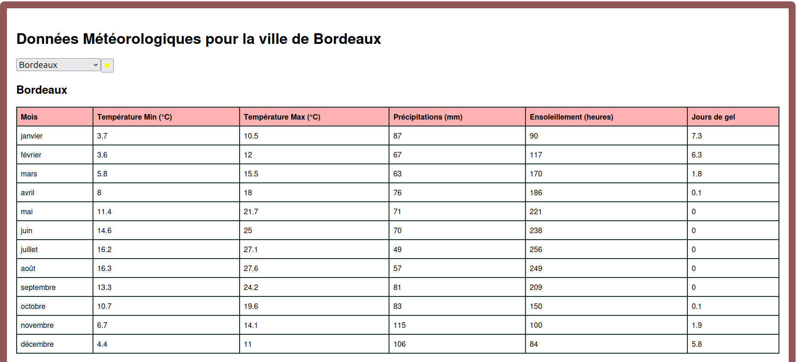
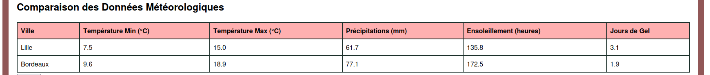
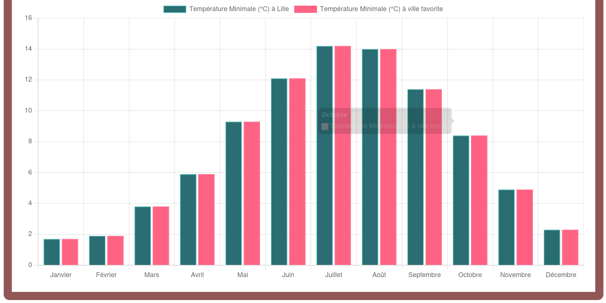

## Introduction

Ce projet s'agit d'une application en `React` qui affiche les données météo de plusieurs villes.  
L'utilisateur peut choisir une ville, voir ses informations météo et définir une ville favorite, Les données méteorologiques sont affichées en format tableau et en format graphique 
## Technologies utilisée
- React  
- Webpack  
- Node.js / NPM  
- HTML / CSS / JavaScript 
## Démarrage du projet
### 1. Cloner le dépôt

```bash
git clone <url>
```

### 2. Aller dans le dossier du projet

```bash
cd tp5
```

### 3. Installer les dépendances

```bash
npm install
```

### 4. Lancer le projet (mode développement recommandé)

Ce mode permet de voir les changements automatiquement après chaque modification :

```bash
npm run dev-server
```

Ouvrir ensuite ce fichier dans un navigateur :

```
dist/index.html
```

### 5. Générer la version production (bundle)

Pour créer le bundle final du projet :

```bash
npm run build
```

Puis ouvrir :

```
./dist/index.html
```

### 1. Cloner le dépôt
### 2. Installer les dépendances
### 3. Lancer le projet en développement
### 4. Générer le build de production
## Aperçu

Voici quelques captures d'écran de l'application en fonctionnement :

### Données météorologiques pour une ville sélectionnée


### Comparaison avec la ville favorite


### Graphique de comparaison

